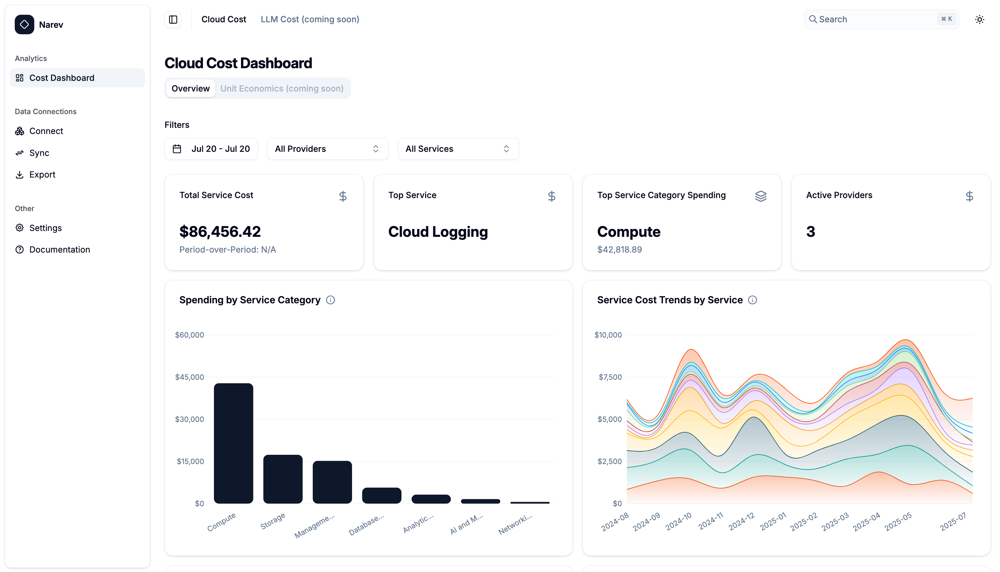

# Narev

**Master the AI and cloud cost-speed-quality tradeoff with unified analytics.**

[](https://github.com/narevai/narev/commits)
[](https://github.com/narevai/narev/tags)
[](https://github.com/narevai/narev)
[](LICENSE)

Narev is an open source, self-hosted FinOps platform for analyzing and optimizing your AI and cloud spend. It unifies cost and usage data from AWS, Azure, GCP, and OpenAI, providing real-time dashboards, FOCUS-compliant analytics, and actionable recommendations—all while keeping your data private and under your control.



## Features

- **Multi-Cloud & AI Support:** Analyze costs across AWS, Azure, GCP, and OpenAI.
- **FOCUS-Compliant:** Standardizes data using the FinOps Open Cost and Usage Specification.
- **Self-Hosted:** Your data, your infrastructure—no third-party sharing.
- **Real-Time Insights:** Live dashboards, usage breakdowns, and actionable recommendations.

## Quick Start

### Demo Mode (with sample data)
```bash
docker run -d \
  --name narev \
  -p 8000:8000 \
  -v $(pwd)/data:/app/data \
  -e DEMO="true" \
  ghcr.io/narevai/narev:latest
```

### Production
First, generate an encryption key:
```bash
python -c "from cryptography.fernet import Fernet; print(Fernet.generate_key().decode())"
```
Then run the container with your generated key:
```bash
docker run -d \
  --name narev-prod \
  -p 8000:8000 \
  -v $(pwd)/data:/app/data \
  -e ENCRYPTION_KEY="gAAAAABhZ_your_actual_generated_key_here" \
  -e ENVIRONMENT="production" \
  ghcr.io/narevai/narev:latest
```
- Full production setup in the [Deployment Guide](https://www.narev.ai/docs/getting-started/deployment.html).

## License

Apache 2.0

---

## Acknowledgments

Thanks to [@satnaing](https://github.com/satnaing) for the excellent [front end starter](https://github.com/satnaing/shadcn-admin/tree/main)
