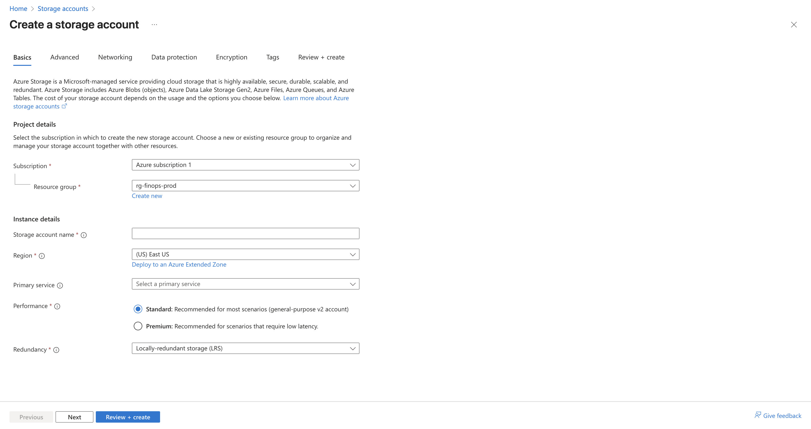
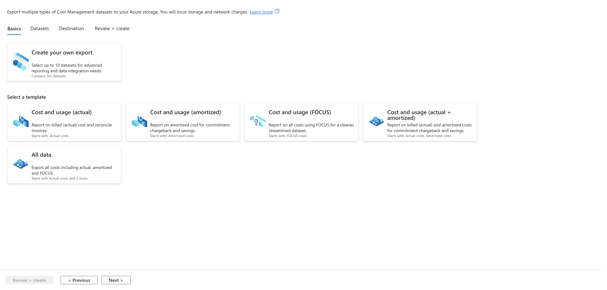
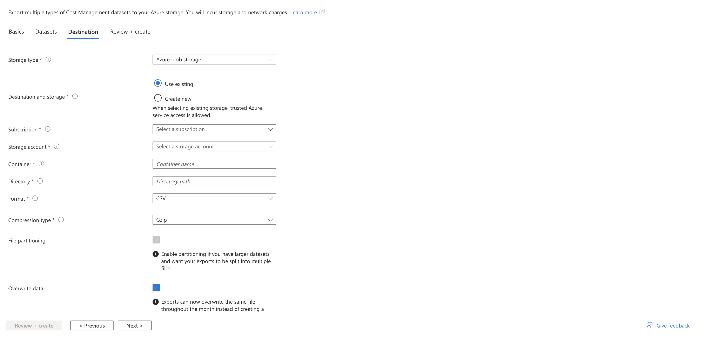
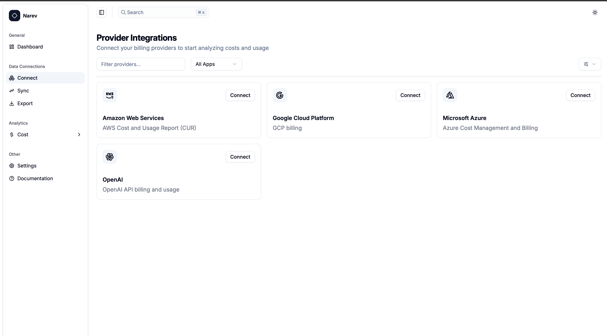
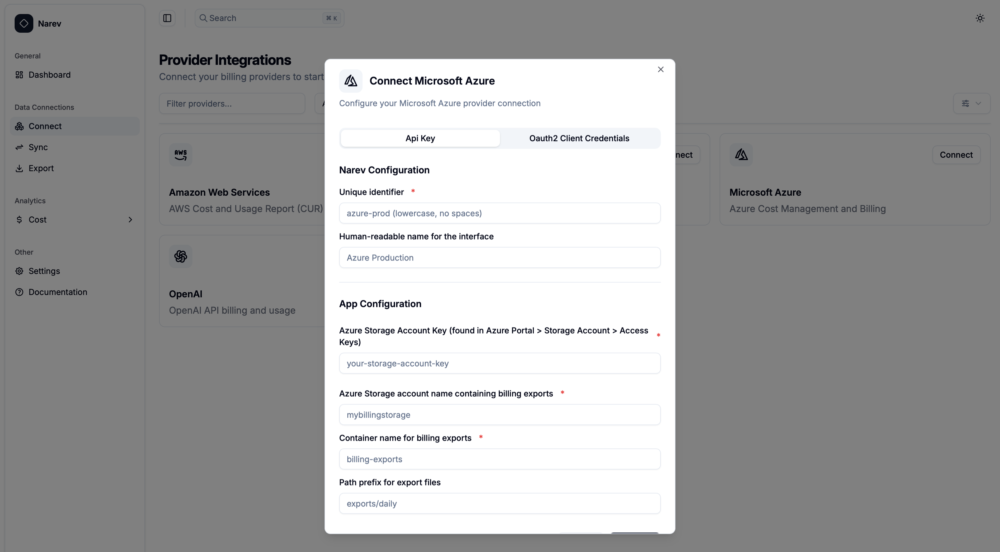

# Azure Provider

The Azure provider allows you to collect billing and cost management data from
Microsoft Azure using billing exports stored in Azure Storage for analysis in NarevAI.

## Prerequisites

- Active Microsoft Azure subscription with billing data access
- Azure Storage account configured for billing exports
- Billing export configured and running
- Storage account access key or appropriate permissions

## Setting Up Azure Billing Export

### 1. Create Storage Account

1. Sign in to the Azure Portal
2. Navigate to **Storage accounts**
3. Click **Create** to create a new storage account



4. Configure the storage account:
   - Subscription: Select your billing subscription
   - Resource group: Create new or select existing
   - Storage account name: Choose a unique name (e.g., `mybillingstorage`)
   - Region: Select appropriate region
   - Performance: **Standard** (sufficient for billing data)
   - Replication: **LRS** (Locally redundant storage) or as needed
5. Click **Review + create** and then **Create**

### 2. Create Container for Exports

1. Navigate to your newly created storage account
2. Go to **Data storage** > **Containers**
3. Click **+ Container**
4. Configure the container:
   - Name: `billing-exports` (or your preferred name)
   - Public access level: **Private** (recommended for security)
5. Click **Create**

### 3. Set Up Cost Management Export

1. Navigate to **Cost Management + Billing**
2. Select your billing scope (subscription, resource group, etc.)
3. Go to **Settings** > **Exports**
4. Click **Create** to create a new export

#### Step 1: Basics



5. **Select Export Template**: Choose **Cost and usage (FOCUS)** template
   - This exports data in FOCUS 1.0 format, which NarevAI maps to FOCUS 1.2
   - Avoid other templates as they may not be fully supported

#### Step 2: Datasets
7. **Specify export prefix** (required to ensure unique export names)
   - Enter a prefix for all exports (e.g., `billing`, `focus`, `narev`)
   - This ensures that exports have unique names



#### Step 3: Destination
8. Configure storage destination:
   - Storage type: **Azure blob storage**
   - Destination: **Use existing** (select your storage account)
   - Subscription: Select your subscription
   - Storage account: Select the storage account you created
   - Container: Enter the container name you created
   - Directory: Optional subdirectory (e.g., `exports/daily`)
   - Format: **Parquet** (recommended) or **CSV**
   - Compression: **Snappy** (for Parquet) or **Gzip** (for CSV)
   - Overwrite data: ✅ **Checked** (recommended to save storage costs)


#### Step 4: Review + Create
9. Review your configuration and click **Create**

### 4. Note Your Configuration

After setup, note these details for NarevAI configuration:

- Storage account name: The name of your storage account
- Container name: The container where exports are stored
- Export path: Any subdirectory path (if configured)

## Storage Account Access Setup

### Getting Storage Account Key

1. Go to your storage account in the Azure Portal
2. Navigate to **Security + networking** > **Access keys**
3. Under **key1** or **key2**, click **Show** next to the key
4. Copy the entire key value (long string starting with letters/numbers)
5. Store it securely - this will be used for authentication

::: warning Storage Key Security
Storage account keys provide full access to your storage account.
Store them securely and rotate them regularly.
Consider using more restrictive authentication methods for production environments.
:::

## Adding Azure Provider in NarevAI

### Step 1: Navigate to Connect

1. In the NarevAI sidebar, under **Data Connections**, click **Connect**
2. You'll see the "Provider Integrations" page with available providers



### Step 2: Select Azure Provider

1. Find the **Microsoft Azure** card in the provider grid
2. Click the **Connect** button on the Azure card
3. The Azure configuration dialog will open



### Step 3: Configure Azure Provider

#### Narev Configuration

**Provider Name** ✅ *Required*
- Unique identifier (e.g., `azure-prod`, `company-azure`)
- Format: lowercase letters, numbers, hyphens, underscores only

**Display Name** (Optional)
- Human-readable name (e.g., `Azure Production`, `Company Azure`)
- Shown in the interface

#### App Configuration - Azure Credentials ✅ *Required*

**Storage Account Key** ✅
- Your Azure Storage account access key (long alphanumeric string)
- Password field with show/hide toggle
- Found in Azure Portal > Storage Account > Access Keys

#### Provider-Specific Configuration

**Storage Account** ✅ *Required*
- Storage account name with exports (e.g., `mybillingstorage`)
- Must match the storage account you configured in Azure

**Container Name** ✅ *Required*
- Container with billing exports (e.g., `billing-exports`)
- Must match the container you created in Azure

**Export Path** (Optional)
- Path prefix for export files (e.g., `exports/daily`)
- Leave empty if exports are in root of container

### Step 4: Connect Provider

1. Review all configuration settings
2. Click the **Connect** button
3. NarevAI will test the connection to your Azure Storage
4. If successful, the provider will be added and appear as "Connected"
5. You can now sync billing data from this Azure account

**Connection Test includes:**
- Storage account access verification
- Container access check
- Export files detection
- Permissions verification

## Configuration Examples

### Basic Setup

```text
Provider Name: azure-main
Display Name: Main Azure Account
Storage Account Key: [your-storage-account-key]
Storage Account: mybillingstorage
Container Name: billing-exports
```

### With Custom Export Path

```text
Provider Name: azure-organized
Display Name: Azure Production Environment
Storage Account Key: [your-storage-account-key]
Storage Account: companyazurestorage
Container Name: cost-exports
Export Path: daily/detailed
```

### Multi-Environment Setup

```text
Provider Name: azure-dev
Display Name: Azure Development
Storage Account Key: [your-storage-account-key]
Storage Account: devbillingstorage
Container Name: dev-exports
Export Path: development/costs
```

### Common Test Results

#### Success Response

```text
Successfully connected to Azure Storage
Storage Account: mybillingstorage
Container: billing-exports
Export Path: exports/daily
Files Found: 28
Auth Method: api_key
```

#### Container Not Found

```text
Container 'billing-exports' not found
```

- Solution: Verify the container name spelling and ensure it exists in the
  storage account

#### Access Denied

```text
Azure Error: AuthenticationFailed
```

- Solution: Verify your storage account key is correct and not expired

#### Storage Account Not Found

```text
Azure Error: ResourceNotFound
```

- Solution: Check the storage account name and ensure it exists in your subscription

## Supported Features

The Azure provider supports:

- ✅ Billing export data from Azure Cost Management
- ✅ Cost analysis and breakdown by service
- ✅ Resource tags for cost attribution
- ✅ Budget alerts integration
- ✅ FOCUS format compatibility
- ✅ Multiple export schedules (daily, monthly)

## Troubleshooting

### Authentication Issues

- Verify the storage account key is copied completely without extra spaces
- Check that the storage account key hasn't been rotated or expired
- Ensure you're using the correct storage account name

### Storage Access Problems

- Confirm the container exists and is spelled correctly
- Verify the export path matches your Cost Management export configuration
- Check that the storage account is in the same subscription as your billing scope

### Export Configuration Issues

- Ensure your Cost Management export is actively generating files
- Verify the export is configured to use the correct storage account and container
- Check that the export has run at least once (may take 24 hours after creation)

### Permission Errors

- Confirm you have access to the storage account keys
- Verify your Azure account has permissions to read from the storage account
- Check that the storage account is accessible from your location

### No Data Found

- Verify that billing exports are being generated
  (check Azure Cost Management > Exports)
- Ensure the export path in NarevAI matches the directory configured in your export
- Check if your billing period has completed for data to be available

## Export File Formats

Azure Cost Management exports billing data in multiple formats:

- **Parquet format** (recommended): Column-oriented format with efficient
  compression, better for large datasets and analytics
- **CSV format**: Traditional comma-separated values, universally readable
- **Compression options**: Snappy compression for Parquet, Gzip for CSV
- **File partitioning**: Large files are automatically split into manageable chunks
- **Daily exports**: Updated daily with month-to-date data
- **File naming**: Includes date stamps and billing periods

## Data Collection

Once configured, the Azure provider will collect:

- Usage metrics: Service consumption, resource hours, API calls
- Cost data: Pay-as-you-go costs, reservation savings, spot pricing
- Resource information: Virtual machines, storage usage, network traffic
- Billing hierarchy: Subscription, resource group, and resource-level costs
- Tags and metadata: Custom tags for cost allocation and analysis
- Time-series data: Daily cost and usage patterns

Data collection runs automatically based on your configured schedule and will
appear in the NarevAI dashboard after the first successful sync.
Azure billing data is typically updated daily as exports are generated.
