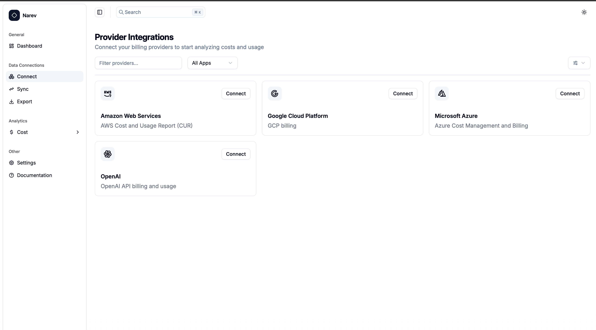

# OpenAI Provider

The OpenAI provider allows you to collect billing and usage data
from the OpenAI platform for analysis in NarevAI.

## Prerequisites

- Active OpenAI account with API access
- Administrator permissions in your OpenAI organization
- Admin API key with billing access permissions
- Optionally: Organization ID (for accounts with multiple organizations)

## Creating an Admin API Key

### 1. Access OpenAI Platform

1. Go to [platform.openai.com](https://platform.openai.com)
2. Sign in to your OpenAI account
3. Ensure you have administrator permissions in your organization

### 2. Generate Admin API Key

1. In the left sidebar, select **API keys**
2. Click **Create new secret key**
3. In the key creation form:
   - **Name**: Provide a descriptive name (e.g., "NarevAI Billing Access")
   - **Permissions**: Select **All** or **Custom** with permissions for:
     - `organization.billing.read`
     - `organization.usage.read`
   - **Project**: Choose the appropriate project or leave as "All projects"

::: warning Admin Key Requirements
Keys with access to billing data have the format `sk-admin-*` or `sk-*` with
extended permissions. Regular `sk-*` keys without administrator permissions
will not work for billing data access.
:::

### 3. Copy the Key

1. Copy the key immediately - it will only be shown once
2. Save it in a secure location
3. The key should have the format: `sk-admin-xxxxxxxxxxxxxxxxxxxxxxxxxxxxxxxxxxxxxxxx`

## Adding OpenAI Provider in NarevAI

### Step 1: Navigate to Connect

1. In the NarevAI sidebar, under **Data Connections**, click **Connect**
2. You'll see the "Provider Integrations" page with available providers



### Step 2: Select OpenAI Provider

1. Find the **OpenAI** card in the provider grid
2. Click the **Connect** button on the OpenAI card
3. The OpenAI configuration dialog will open


### Step 3: Configure OpenAI Provider

#### Narev Configuration

**Provider Name** ✅ *Required*
- Unique identifier (e.g., `openai-main`, `company-openai`)
- Format: lowercase letters, numbers, hyphens, underscores only

**Display Name** (Optional)
- Human-readable name (e.g., `Main OpenAI Account`, `Company OpenAI`)
- Shown in the interface

#### App Configuration - OpenAI Credentials ✅ *Required*

**Token** ✅
- Your OpenAI admin API key (format: `sk-admin-xxxxxxxxxxxxxxxxxxxxxxxx`)
- Password field with show/hide toggle

#### Provider-Specific Configuration

**API Endpoint** (Optional)
- Custom API endpoint (default: `https://api.openai.com/v1`)
- Use only for custom deployments or proxies
- **Important**: Proxy must provide usage data in OpenAI-compatible format

**Organization ID** (Optional)
- OpenAI organization identifier (format: `org-XXXXXXXXXXXXXXXXXX`)
- Leave empty to use your default organization

### Step 4: Connect Provider

1. Review all configuration settings
2. Click the **Connect** button
3. NarevAI will test the connection to OpenAI API
4. If successful, the provider will be added and appear as "Connected"
5. You can now sync billing data from this OpenAI account

**Connection Test includes:**
- API key validity check
- Billing endpoints access verification
- Organization permissions verification (if specified)

## Configuration Examples

### Basic Setup

```text
Provider Name: openai-main
Display Name: Main OpenAI Account
Token: sk-admin-xxxxxxxxxxxxxxxxxxxxxxxxxxxxxxxxxxxxxxxx
```

### Multi-Organization Setup

```text
Provider Name: openai-prod
Display Name: Production OpenAI Organization
Token: sk-admin-xxxxxxxxxxxxxxxxxxxxxxxxxxxxxxxxxxxxxxxx
Organization ID: org-ABC123DEF456GHI789
```

### Custom Endpoint Setup

```text
Provider Name: openai-proxy
Display Name: OpenAI via Corporate Proxy
Token: sk-admin-xxxxxxxxxxxxxxxxxxxxxxxxxxxxxxxxxxxxxxxx
API Endpoint: https://api-proxy.company.com/openai/v1
```

### Common Test Results

#### Success Response
```text
Successfully connected to OpenAI API
Endpoint: https://api.openai.com/v1
Organization: org-ABC123DEF456GHI789
```

#### Authentication Failed
```text
Authentication failed - please check your API key
```
**Solution**: Verify your API key is correct and has admin permissions

#### Connection Failed
```text
Connection failed with status 403
```
**Solution**: Ensure your API key has billing access permissions

## Supported Features

The OpenAI provider supports:

- ✅ Usage data by model
- ✅ Usage data by API key
- ✅ Daily usage aggregation
- ✅ Organization-level data
- ✅ Custom API endpoints

## Troubleshooting

### Invalid API Key Format

- Ensure your key starts with `sk-admin-` or has admin permissions
- Regular `sk-` keys without billing access will not work

### Organization Access Issues

- Verify you're a member of the specified organization
- Check that the organization ID is correct (starts with `org-`)
- Ensure your API key has access to the organization

### Network/Endpoint Issues

- Verify the API endpoint URL is correct
- Check if your network allows access to OpenAI's API
- For corporate networks, you may need to use a proxy endpoint

### Permission Errors

- Confirm your API key has `organization.billing.read` permissions
- Ensure you have administrator role in the OpenAI organization
- Some billing data may require higher permission levels

## Data Collection

Once configured, the OpenAI provider will collect:

- Usage metrics: Token consumption, request counts, model usage
- Billing data: Costs, usage charges, credit consumption
- Organization data: Multi-organization billing breakdown
- Time-series data: Daily aggregated metrics

Data collection runs automatically based on your configured schedule and will
appear in the NarevAI dashboard after the first successful sync.
